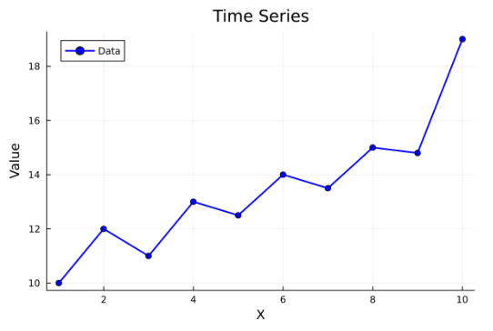
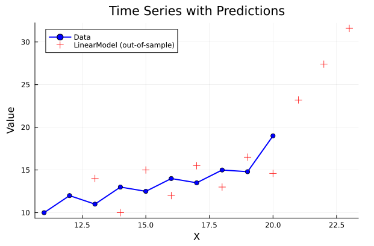
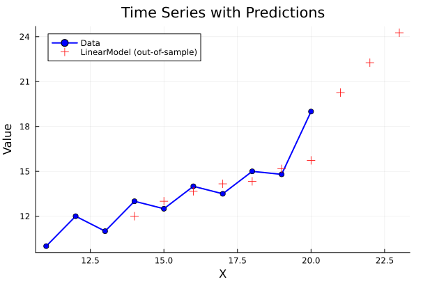
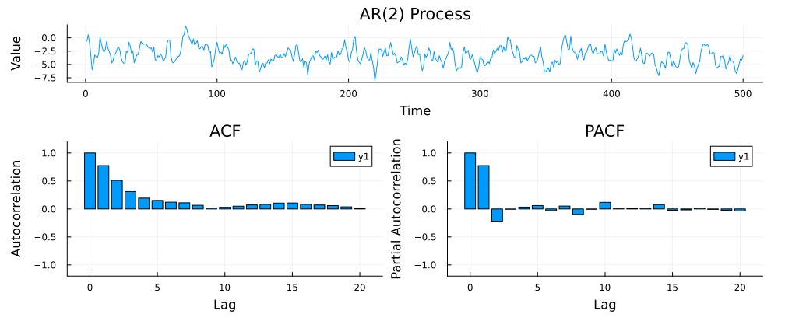

# TimeSeriesKit.jl

[](https://github.com/YannickGibson/TimeSeriesKit.jl/actions/workflows/CI.yml?query=branch%3Amain)
[](https://codecov.io/gh/YannickGibson/TimeSeriesKit.jl)

**TimeSeriesKit.jl** is a Julia package for time series analysis and manipulation. It provides tools for managing time series datasets, methods for forecasting, validation techniques, and visualization capabilities.

# Overview
## Features
- Rolling Ridge Regression
- AR/MA, ARMA
- Single Exponential Smoothing
- Cross-validation techniques for time series and parameter space search
- Dataset loading
- Visualization tools


### Julia and implementation features
- Multiple dispatch
- Broadcasting
- Code coverage

# Installation

For development Julia 1.11.7 was used.

**Clone repository**
```bash
git clone https://github.com/username/ProjectName.git TimeSeriesKit
```
**Open Julia**
```bash
julia
```

**Add the package to an environment**
```bash
]
add TimeSeriesKit
⌫
```


**Use the package**
```julia

using TimeSeriesKit
```

# Usage

Check the folder `examples/` for complete illustration.

## Creating time series
```julia
import Plots
using TimeSeriesKit
ts = TimeSeries([10.0, 12.0, 11.0, 13.0, 12.5, 14.0, 13.5, 15.0, 14.8, 19.0])
plot_timeseries(ts)
```


## Fitting a linear model
### Sliding window 2
```julia
# Create linear model
model_linear = LinearModel(sliding_window=2)

# Predict series with forecast of 4
out_of_sample = iterative_predict(model_linear, ts, 4)
plot_timeseries(ts, out_of_sample)
```

### Sliding window 3
```julia
# Create linear model
model_linear = LinearModel(sliding_window=3)

# Predict series with forecast of 4
out_of_sample = iterative_predict(model_linear, ts, 4)
plot_timeseries(ts, out_of_sample)
```

## Linear Stochastic Processes

```julia
# AR(2) process: φ1 = 0.9, φ2 = -0.2, constant = 1.0 → X_t = -1.0 + 0.9*X_{t-1} - 0.2*X_{t-2} + ε_t
# Characteristic polynomial: 1 - 0.9*z + 0.2*z^2
# Roots: z1 = 2.5, z2 = 2.0 (both > 1)
# ⇒ process is stationary

ts = ARProcess(500, phi=[0.9, -0.2], constant=1.0)
plot_acf_pacf(ts)
```
